# MoneyMate App

A full-stack money transfer app — sign up, send money to other users, and track your transaction history.

---

## Features

- Sign up / Sign in with JWT auth
- Dashboard showing your balance and all other users
- Send money via modal (no page navigation)
- Transaction history with pagination (7 per page)
- Edit profile (first name, last name, password)
- Logout from profile icon
- Auth guards — signed-in users can't access signin/signup routes

---

## Tech Stack

| Layer    | Tech                          |
|----------|-------------------------------|
| Frontend | React, Vite, Tailwind CSS     |
| Backend  | Node.js, Express              |
| Database | MongoDB Atlas (Mongoose)      |
| Auth     | JWT                           |

---

## Local Setup

### Prerequisites

- Node.js v18+
- A [MongoDB Atlas](https://cloud.mongodb.com) account with a free cluster

---

### 1. Clone the repo

```bash
git clone <repo-url>
cd MoneyMate
```

---

### 2. Backend setup

```bash
cd backend
npm install
```

Create / update `backend/.env`:

```env
DB_URL="mongodb+srv://<user>:<password>@<cluster>.mongodb.net"
```

> **Important:** Do not end the URL with a trailing slash.  
> Whitelist your current IP in MongoDB Atlas → Network Access.

Start the backend:

```bash
node index.js
```

Backend runs at `http://localhost:3000`

---

### 3. Frontend setup

Open a new terminal:

```bash
cd frontend
npm install
npm run dev
```

Frontend runs at `http://localhost:5173`

---

### 4. Open the app

Visit `http://localhost:5173` in your browser. Sign up and start transferring money.

---

## Demo Screenshots

### 1. Sign Up
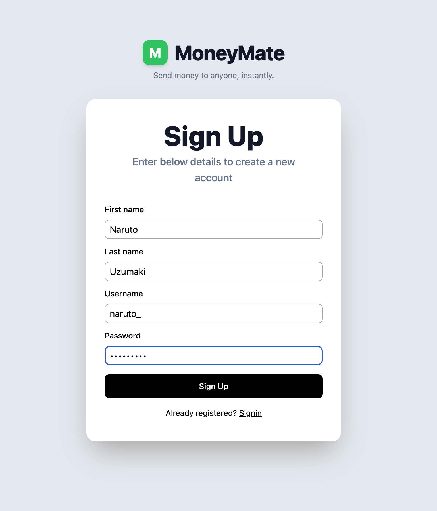

### 2. Dashboard
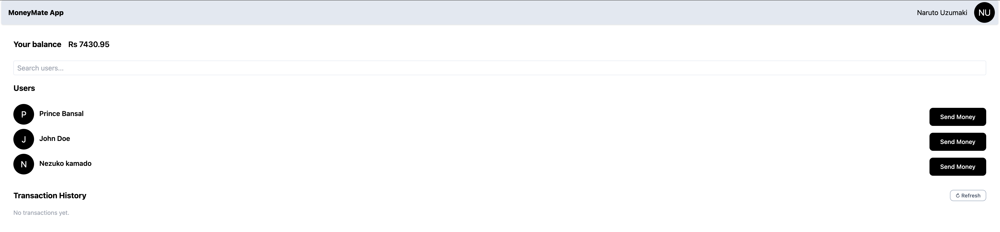

### 3. Search Users
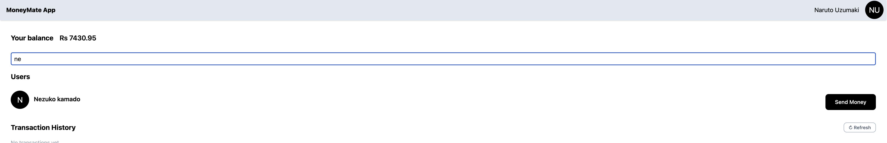

### 4. Send Money
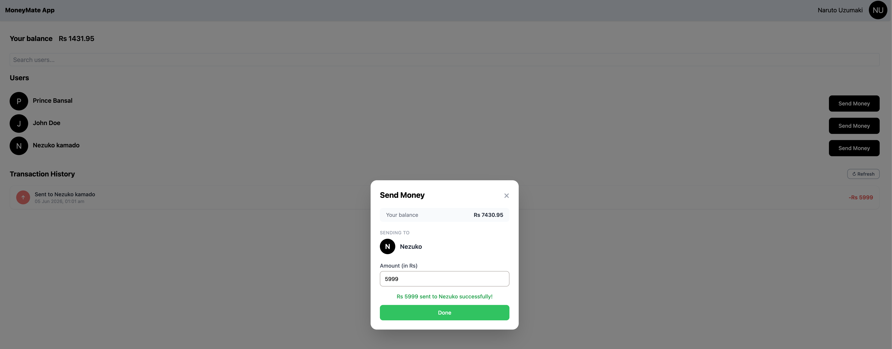

### 5. Send Money — Confirm
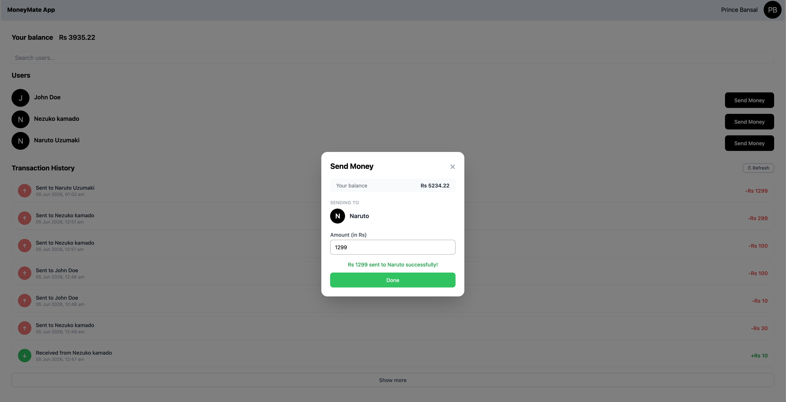

### 6. Transaction History
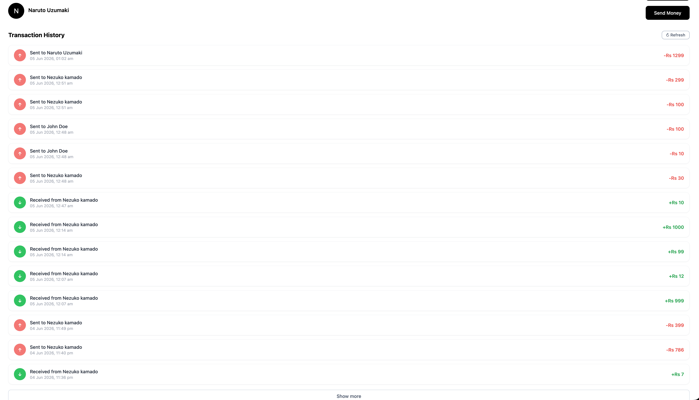

### 7. Transaction Limit (Show More)
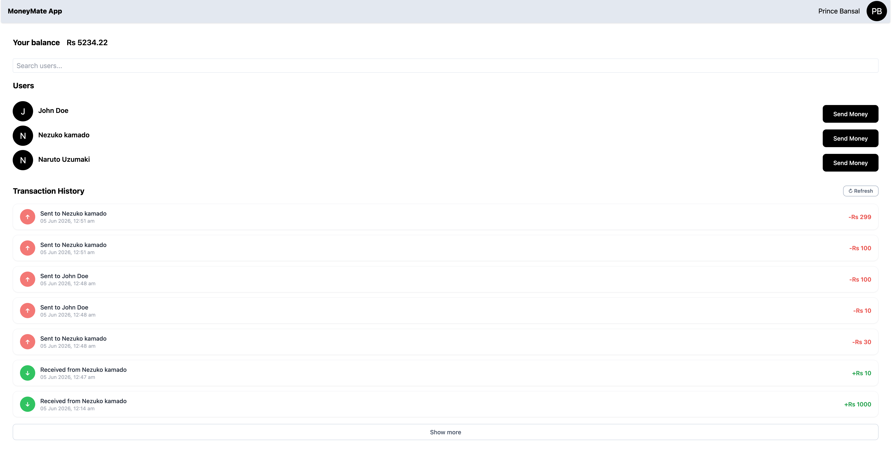

### 8. Received Money
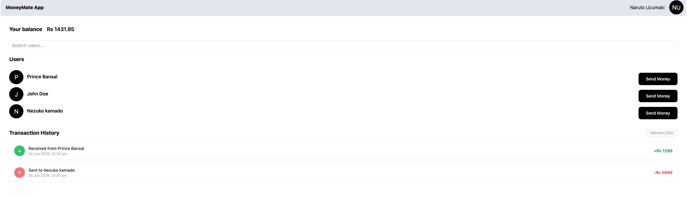

### 9. Edit Profile
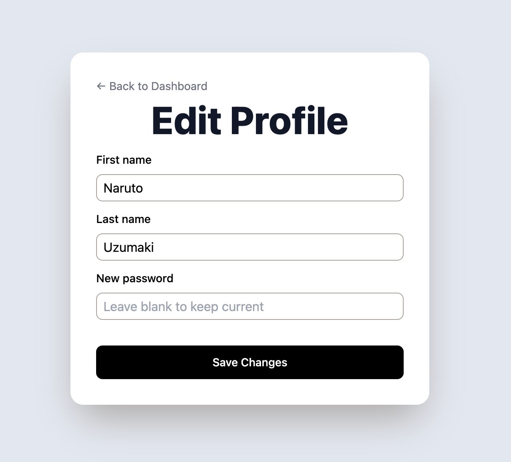

### 10. Logout
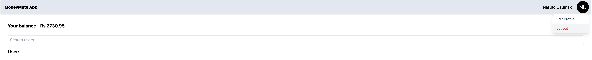

### 11. Incorrect Password
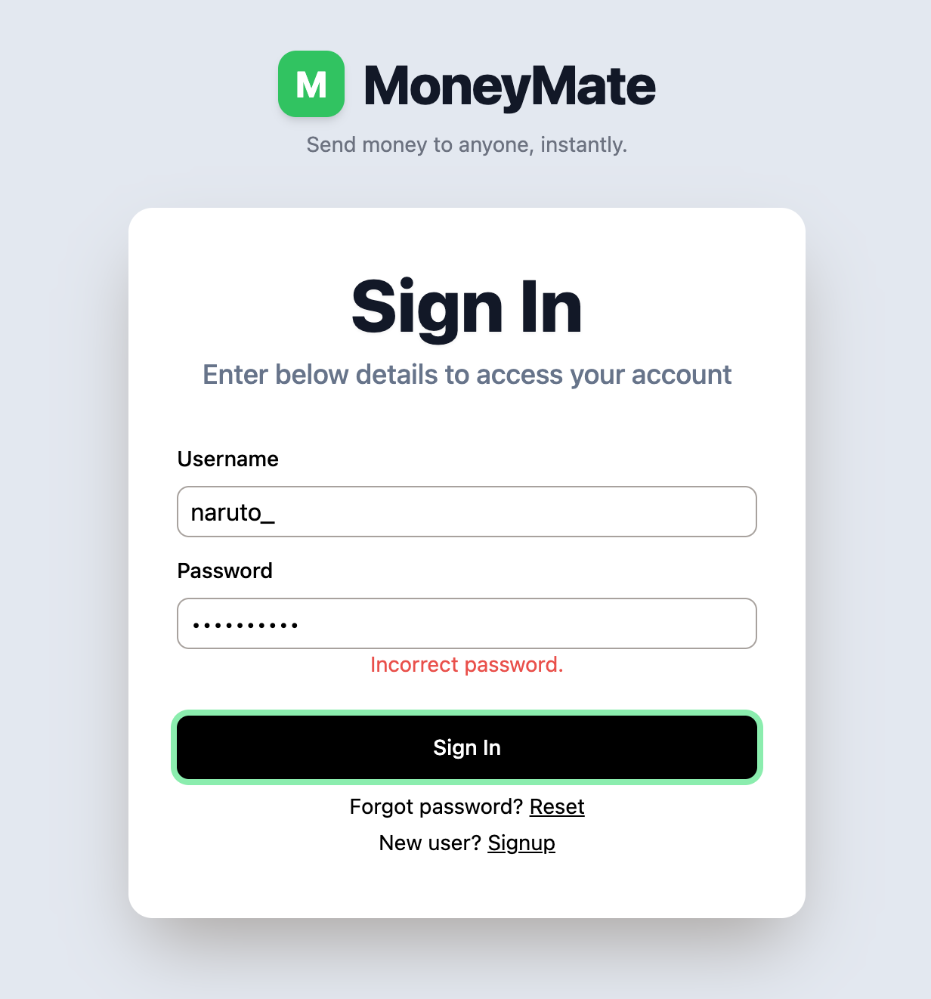

### 12. Incorrect Username
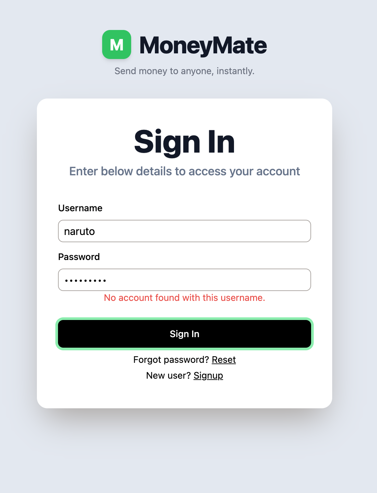

---

## Intial Demo

- Backend completed | [Demo](https://youtu.be/pTencsijI2Q)
